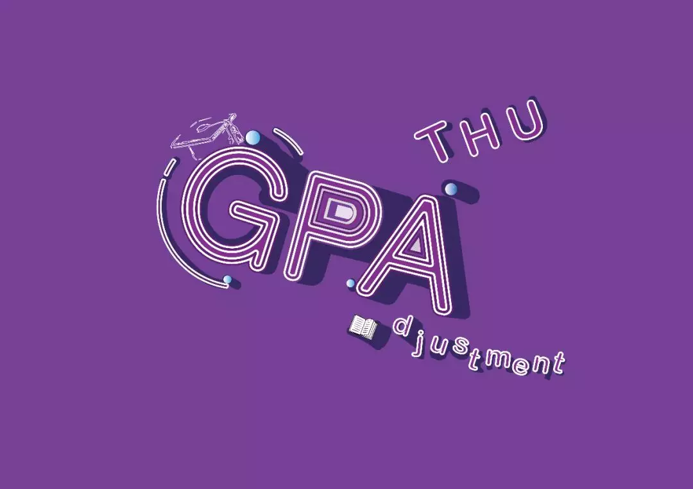
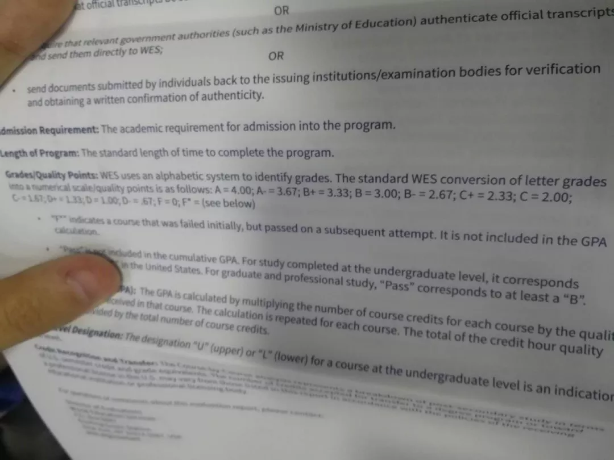
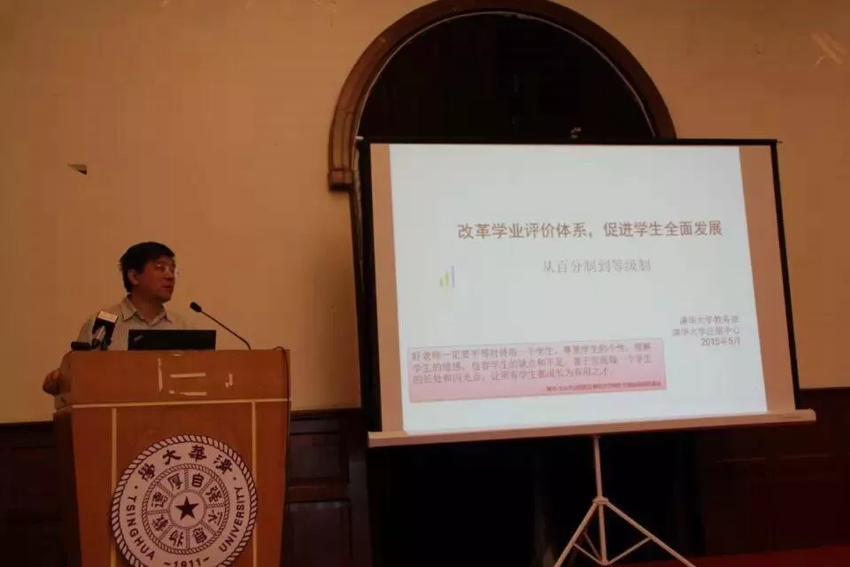
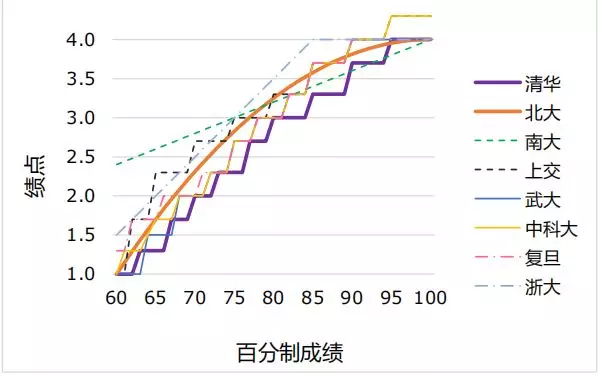
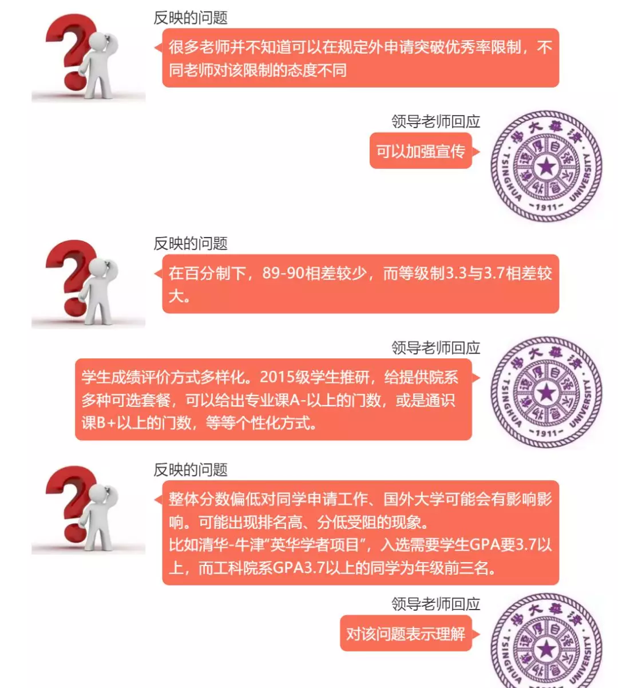
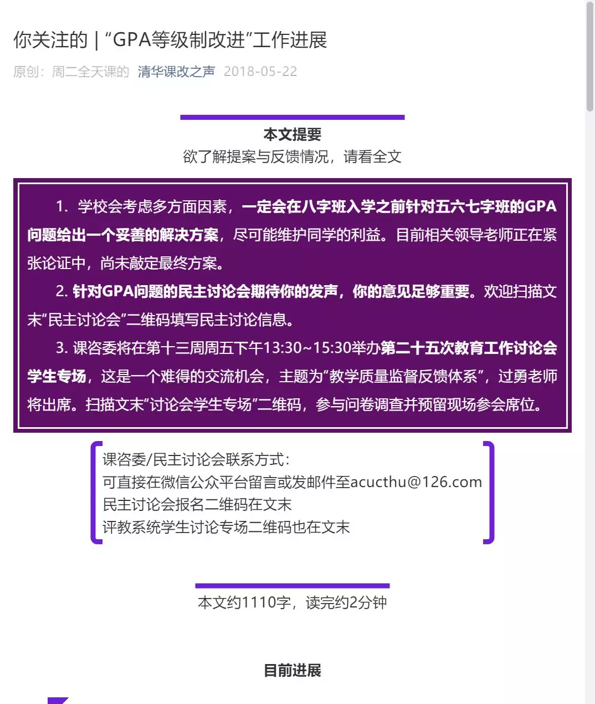
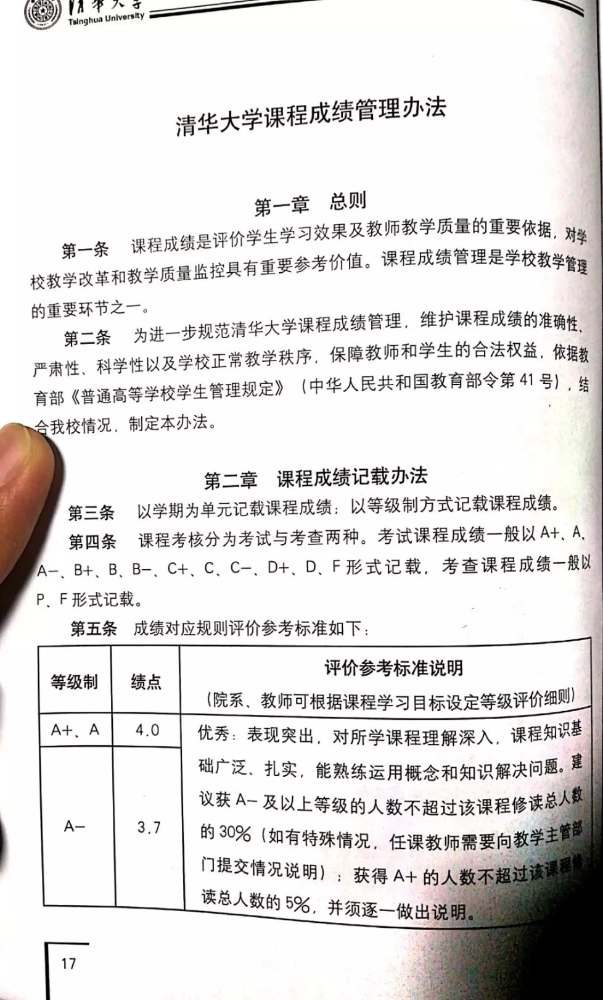

# 深度丨谁动了我的GPA？

> 原创： 张艺璇 清华大学清新时报 今天

**记者丨张艺璇**

**责编丨黄思南**

**排版丨陈施羽**

**美编丨荆晓青**

三月，比北京的春天更早开始喧嚷的，是朋友圈里留学中介的“喜报”。

“offer 速报！热烈祝贺学员录取加州大学伯克利分校硕士！”

各位清华留学党红着眼睛熬着夜用手机邮箱刷出的一封封offer或是拒信，不仅将影响着他们的未来去向，亦将作为四年前开启的GPA改革成果的首次检验。

## 申请罗生门

 “结果爆差。”

计算机系五字班的赵宇翔（化名）以“爆差”形容清华今年总体的留学申请情况。

“我的中介不至于说快疯掉，但落差很大，原来觉得我应该是在美国拿很多offer的人，现在的结果来看——有点惨。”

原本期待拿到博士offer的赵宇翔，把目标改为了硕士。

赵宇翔认为，GPA（本文中GPA均指平均学分绩点，绩点均指单科绩点）与今年的申请结果有着直接关系：“从结果来看，清华学生的GPA太低了，从我周围同学看，申请博士很吃亏。”

伍佳（化名）来自外文系，同是五字班的她并没有感受到GPA造成的申请障碍：“我觉得计算机、软件、统计学等一些专业的项目可能对GPA比较看重，但对于我们人文社科专业文书、实习等更为重要，GPA影响没那么大。而且计算机等专业同学说申请结果不好，是不是因为今年清华最优秀的同学没有选择留学？或者今年清华报某个项目的学生比往届少？这都有可能。”

某留学中介机构的艾老师每年都会经手包括清华在内的多所高校同学的留学申请咨询，对比之下，她并不认同清华五字班申请结果不佳的说法。

“清华今年的总体结果还不错，没有一些人说得那么惨。”艾接着解释道，“清华的学生，在做申请的时候会出一个新的成绩单，（GPA）会有0.2到0.3的提升。”

艾口中的“新成绩单”，便是五字班留学新政——“出国成绩单”。

2018年9月11日，清华大学教务处官方公众号“学在清华”发布注册中心通知，宣布2019届毕业生可于成绩单自助打印机上打印用于出国申请的英文版学分绩和排名证明。这张证明被广泛解读为“出国成绩单”。

这张清华大学抬头的A4证明上记载申请学生的个人信息、总体GPA和年级排名，加盖注册中心印章。然而，一页证明没有提供学生修读科目的百分制成绩或绩点，没有提供该GPA的计算方法。

为回应同学对出国学分绩计算方法的咨询，教务处在一周后于官网上刊登一则英文声明，指出学生课程绩点根据学生分数的分段分布标准化计算获得。然而，声明仍未提及等第和绩点的映射关系。如果使用原始成绩单的映射关系计算总体学分绩，计算结果与出国学分绩不同。

为了以更好的GPA进行申请，温莎（化名）和很多法学院五字班同学都使用了出国成绩单报名LSAT考试。

法学院入学考试（Law School Admission Test，简称LSAT），是美国法学院入学委员会（Law School Admission Council，简称LSAC）为其下200多所法学院设置的入学资格考试。所有申请美国法律院校的留学生几乎都要参加LSAT考试。

温莎及部分同学的GPA真实性遭到了LSAC的质疑。“因为我们交的出国成绩单没有算法和单科成绩，就只有一段话和一个总绩点，看上去非常‘野鸡’，像是我们学生自己编造的。”

温莎介绍道，本学年清华大学法学院申请美国法律院校的同学有二十多人，其中只有两人顺利通过了材料审核。其中，一名五字班同学没有附加提交出国成绩单，而是仅选择提交原始成绩。另一位通过材料审核的同学由四字班降转五字班，因此他的成绩仍以百分制记录。

自9月份出现第一起机构质疑事件至11月，法学院留学党向院教务处和校教务处反复沟通，多次反映情况，不安和焦虑的情绪在五字班蔓延。

“我们有很多同学经常跑教务处和注册中心。最后是由校方直接和对方沟通，发函提供证明。但一直拖到11月份才解决。”对申请美国大学法学院的同学来说，时间的推移意味着机会的消逝。温莎解释道，ED（Early Decision，提前决定录取）截止日期一般在10月底至11月中旬，申请者若错过ED，便只得在RD（Regular Decision，常规录取）中重新等待机会。但申请材料越早提交审理，录取机会就更大，ED往往意味着能收到更好的offer。

“法学院有几个同学，排名很高。但是因为被拖过了ED而只能RD。其实他们可以申请到更好的学校。”温莎表示，“我们感觉GPA改革搞出这些事，还不如（直接使用）百分制成绩。”

 《清新时报》曾通过邮件与电话联系校教务处与注册中心，希望就GPA改革与五字班出国成绩单进行访谈，但教务处老师表示：“目前来看，出国成绩单引起争议的只是在法学院同学中出现，并且在注册中心与对方学校的联系沟通下，已经得到了解决。但是除此之外出国成绩单并没有产生另外新的问题。”教务处与注册中心谢绝了《清新时报》进一步采访的请求。

自动化系的吴非（化名）为了提高成绩单的认可度，没有选择提交出国成绩单，而是将成绩提交至WES进行认证。WES（World Education Services）认证是目前最受欢迎的国际认证，帮助美国大学认证国际学生的学业成绩。WES认证将85分至90分成绩算作A-，因此对于把同档位成绩算作B+的清华学生来说，WES认证是部分申请留学的同学提高出国成绩单上绩点的途径。所以，即使吴非的申请学校并没有要求出示WES认证成绩单时，为了避免校内低GPA的不利影响，他依然选择进行认证。

“我和我的室友都进行了WES认证。他是四字班降转五字班，所以他有百分制成绩，他认证之后的绩点比原始绩点高了0.3，但是我是五字班没有百分制成绩，所以认证的成绩只提高了0.01。”吴非认为，为了挽救同学们的绩点，应立即开始保留百分制成绩。

“不管校内的绩点怎么算，但是只要还有百分制成绩，就还有退路。”

> WES成绩认证，吴非提供

## 改革春风吹  

GPA改革始于2015级。

2014年10月19日，《清华大学关于全面深化教育教学改革的若干意见》发布，提出改革学业评价体系，将课程成绩从百分制改为等级制。

这不是清华第一次使用等级制。早在1917年清华学校期间，时任校长张煜全力推校务改革，采用“等数计分法”评价学生成绩。1953年至1963年，清华一度实行5分制。但自改革开放以来，延续至2014年，百分制一直是清华以及全国高校学业评价体系的主流。

2015年5月15日，清华大学教务处正式公布了课程等级制成绩体系。等级制自2015年秋季学期，五字班入校时开始实施。

> 图源：公众号“清华课改之声”

8月，清华迎来五字班。社科学院的李修宇在报到时从老师手中接过了向每位新生发放的新生手册，他记得新生手册上详细解释了实行等级制的目的。

“第一是减少同学们刷水课。第二是淡化GPA，让我们有更多时间投入到社工各种活动中。第三是和国际接轨，因为北美高校都是按这个方式来进行的。”李修宇回忆道，“当时，许多四字班学长学姐还很羡慕五字班开始了GPA改革，认为这是件好事。”

随教学改革一起诞生的，还有本科生课程咨询委员会（后文简称“课咨委”）。课咨委负责宣传和反映学校在教学与改革等方面的计划与措施，了解同学的学习状态和想法，并向校方提出合理化建议，力图使学生参与学校教学改革。

首届课咨委主席卢森介绍道，2014年课咨委将学分绩改革作为二号年度重点任务，配合校方对15所国外高校和14所国内高校开始了课程成绩等级制的调研工作。

课咨委在了解哈佛大学、麻省理工大学、普林斯顿大学以及斯坦福大学等世界顶尖高校的基本情况后，以世界高等教育的前沿阵地给清华做了一个参考系。

2015年以前，学生分数正在逐渐膨胀。课咨委调研发现，各类型课程的平均学分绩和高分段学生人数皆逐年增长，平均学分绩从 1994 年的 81分 上升到 2014 年的 86分，85 分以上人数比例从 1994 年的 19%上升到 2014 年的 62%。为了防止分数虚高，学校特别规定每门课程A-及以上等级人数不宜超过班级总人数的20%。

大一的第一个学期，李修宇选修了一节为大三年级学生开设的专业课。作为班级唯一一个五字班学生，班里只有他一人的成绩是按照等级制评分，因此期末时，授课老师特别给他打了一通电话。

“老师说很抱歉，他没办法提交我的成绩。他想给我90分，但是提交A-这个绩点之后，我们班的A-以上成绩段位的人数占比就是100%，因为只有我一个五字班。为了使教务那边通过成绩录入，只能给我一个3.3。”

此后，李修宇总会在选课后谨慎地问问老师班上有没有五个五字班同学选课。20%的规定意味着，如果五名以下五字班同学修读同门课程，在教师不提出申请的情况下，无人可获得A-及以上等第。

在大一上期末结束后，吴非有些郁闷。寒假，高中同学举行聚会，大家聊起了大学第一个学期的学习成绩。看到中科大、厦大等其他学校同学的成绩，吴非“酸了”。

“我的排名并不差啊，怎么绩点跟别的学校的比差这么多？”他这才知道，清华的学分绩档位整体比中科大低了一档。

> 八所高校百分制-绩点换算表
>
> 清华大学本科生学业评价体系改进民主讨论会议程手册

## “改革之改革”

2017年底，课咨委联合校学生会学习部组织了一次调研活动，以了解五、六、七字班同学们对成绩评定体系的意见，并在12月18日的课咨委扩大会议中向校领导反馈了调研成果。

> 图源：清华大学学生会公众号2017年12月24日文章
>
> “GPA改革调研结果反馈”

面对会议反馈推送中校方“加强宣传”和“表示理解”的回应，有同学在学生会公众号文章下留言：“对学校领导的理解表示理解。”

李修宇认为：“其实事后来看，可能在那之前，对于GPA大家一直都有一些不满，但是实际上没有一个真正的表达渠道。甚至在那之前，我觉得可能都没有什么人知道什么是课咨委。”

随后，课咨委联络此前问卷中留下联系方式的同学，成立了“GPA改革之改革”小组。

李修宇进了群。在群内，不少确认出国的五字班同学出于对校内GPA低可能导致申请缺乏竞争力的担忧尝试提出解决方案。一个受欢迎的提议是，将国内其他主流高校对应区间内绩点均值的中位数经四舍五入取为我校对应百分制区间内绩点，如B+的绩点由3.3改为3.6。

> 绩点膨胀方案示意表
>
> 清华大学本科生学业评价体系改进民主讨论会议程手册

随着期末与寒假的来临，“GPA改革之改革”群内的讨论进入“冬歇期”。

直至五字班进入大三下半学期，留学党们开始催促课咨委尽快解决GPA低的问题。群友认为，若要求全校性改动，不仅牵扯众多、影响重大，而且短期内难以实现。“当时我们已经没有奢望要统一改动GPA，大家普遍就是想要学校在申请季之前给出一个出国成绩单。”

群内五字班关于GPA总体偏低的呼声高度统一，大家的讨论主要集中在三个方面：89分与90分之间绩点0.4的断档、A-以上20%的限制、以及不同课程之间的给分差异。

5月27日上午九点，凌晨五点看完欧冠决赛直播的李修宇没有睡觉，而是前去参加了课咨委组织召开的学业评价体系改进民主讨论会。

但是，当会议开始时，他非常失望：“整个流程从始至终，我没有见到一个教务处的老师，这一点我们当时就觉得，好像是过家家糊弄我们。之前课咨委的同学在群里是跟我们明确承诺了，承诺绝对会让我们拿一个比较高的成绩，肯定不会以这么低的成绩去到国外去申请。”

会议中，李修宇能感受到课咨委成员们的无力：即使向同学们做出了八字班入校前给出解决方案的承诺，课咨委也无法决定校方是否处理以及如何处理。

> 图源：公众号“清华课改之声”

课咨委现任主席孙铄谢绝了《清新时报》的置评请求。

民主讨论会后，无事发生。

暑假，申请截止日期逐渐临近。李修宇的申请学校要求他在9月16日前将材料发往国外，他在群内反复催促询问出国用学分绩证明可供打印的具体时间。

“一开始说是八字班入学，然后又说开学，又说是下周一。”李修宇说，“但到9月11号打印了‘出国成绩单’之后，又傻眼了。”李修宇忧虑不含绩点计算方法和单科成绩的学分绩证明可能引发对方学校对自己成绩真实性的怀疑。

9月13日，李修宇突然接到了教务处的电话。他回忆称，电话中教务处表示希望与对GPA改革有意见的同学进行一次座谈。参与座谈者共四人：李修宇和另一位同学，及教务处彭刚老师、注册中心尹佳老师。

根据李修宇的回忆，彭刚老师首先提出，GPA改革改不改终究是学校的权力。彭刚老师表示，针对申请实际情况进行GPA的改动，已经能够说明学校对计划出国留学同学的重视，即使最后申请的结果不如人意，也可以视作是改革的阵痛。

但随即彭刚老师也表示，校方如今正在尽量想办法解决问题。

尹佳老师接着解释，之所以不对外公开新成绩单算法，背后涉及学校名誉、数据处理等多重复杂因素。他同时提出，学校实际已经开始对GPA改革进行局部调整，适用于六、七、八字班。

“调整并不光是因为五字班出国的问题，学校也在反思之前的体系是不是有问题。当时尹佳老师给我看了改革方案的进度表，比如优秀学生比例由20%放宽为30%等，还有很多其他的调整措施。”李修宇说道。

上学期期末，七字班的王曦敏（化名）发现自己的《电路原理》一课百分制成绩为76分，按学分绩换算规则，他的绩点理应是2.3，但实际上只有2.0。王曦敏本以为是分数给错了，以绩点不对应为由向电机系教务处提交了成绩复议表。教务处老师告诉他，这种情况很常见，并建议他参考最新版学生手册规定。

他这才发现，在2018级学生手册上，“百分制”一栏已被删去，这意味着百分制成绩与绩点正式脱钩。此外，优秀率也由20%调整至了30%。记者翻看2018年9月至2019年3月信息门户与教学门户的公告信息，并未查询到有关学分绩制度调整的说明通知。王曦敏说道：“我不为这一门课的成绩难过，但不知道这是不是意味着老师可以随意给分。”

> 上图：2018级学生手册第17页
>
> 下图：2017级学生手册第18页
>
> 除了删去了百分制与绩点的对应关系，还将A-以上比例由20%调整为30%。

李修宇认为，虽然退回百分制已不符合现实，但不能以改革的天然正当性为外衣蛮横改革，损害学生权益。

“整个渠道没有一个透明的机制，所有流程是在一个黑箱中做出来的。学校没有给我们释放一个明确的信号，我们都是根据课咨委或者别人给出的信号来判断、揣测。且不说让同学们参与决策时会让同学们对决策有一定的影响力，至少应当实现知情权。”

 

五字班毕业倒计时一百天，李修宇已确认毕业去向，温莎、赵宇翔与吴非陆续收到了满意的offer。半年后，无数班飞赴世界各地的航班将载着他们驶离北京的天际线。

“五字班学姐留学经验分享会”、“海外研修介绍会”，六教里的公告板上的海报总能提醒来往者：时光匆匆，未雨绸缪。五字班之于留学申请，由进行时的亲历者，变为过去时的分享人。在他们离开的同时，六字班的申请季也即将拉开序幕。

计算机系的赵宇翔在解答学弟学妹的留学问题时，他总习惯多问一句：“你是想申请计算机硕士还是博士？”随即他解释道，博士申请很难，要做好心理准备。吴非更希望：“五字班毕业不是结束，针对六字班、七字班学弟学妹们的GPA改革调整方案要尽快提上日程。”

 

2018年《光明日报》刊发评论员文章《建立科学统一规范的高校学分绩点评价体系》。文章指出：“我国高校学分绩点制无论是理论研究还是实践应用都处于初期阶段，各高校并没有建立统一的绩点转换标准，这在一定程度上影响了高校教学改革的成效。”

“改革能不能停呢？不能停。的确存在问题，但是整体的制度还要执行下去，并在其中进行修正；这才叫‘不忘初心’。”在2017年课咨委（扩大）会议上，邱勇校长如是说道。

> 本文图片来自网络

---

